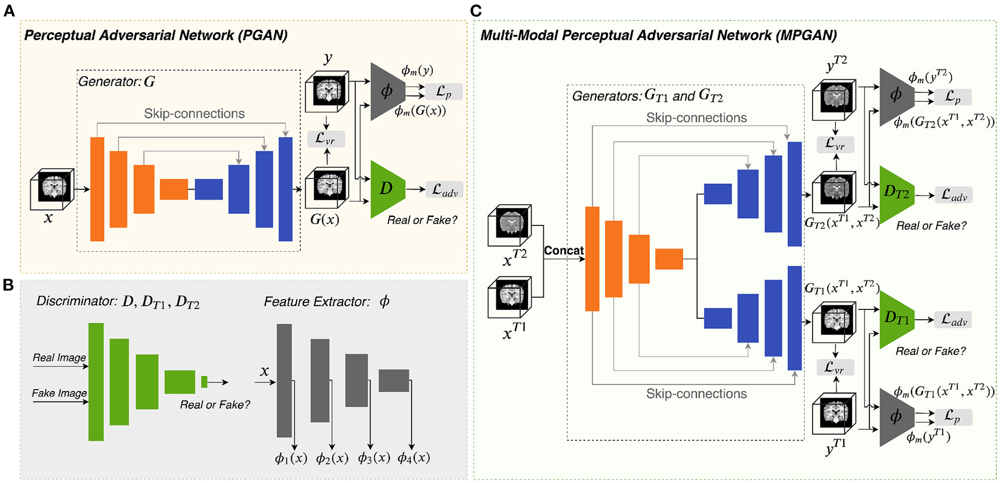

# DeepImputation

Tensorflow Implementation of cross-modality and longitudinal image imputation based on [Longitudinal Prediction of Infant MR Images With Multi-Contrast Perceptual Adversarial Learning](https://www.frontiersin.org/articles/10.3389/fnins.2021.653213/full)

## Requirements
Tensorflow==2.5.1

## Usage
### Cross-modality prediction
#### Preprocess data
```bash
> python3 build_pickle_data.py
```
#### Train (T1 to T2 imputation)
```bash
> python3 train_fromT1toT2.py
```

#### Test
check test_fromT1toT2.ipynb how to impute T2 images from T2 images
### Longitudinal prediction
#### Preprocess data
#### Train
#### Test

## Arichitecture


## Results
